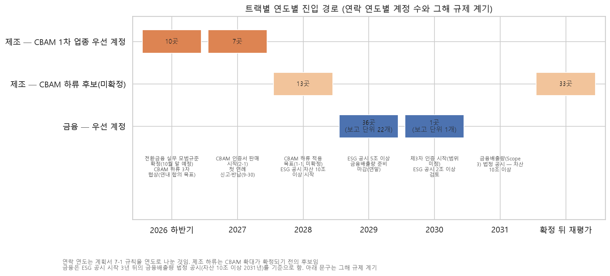
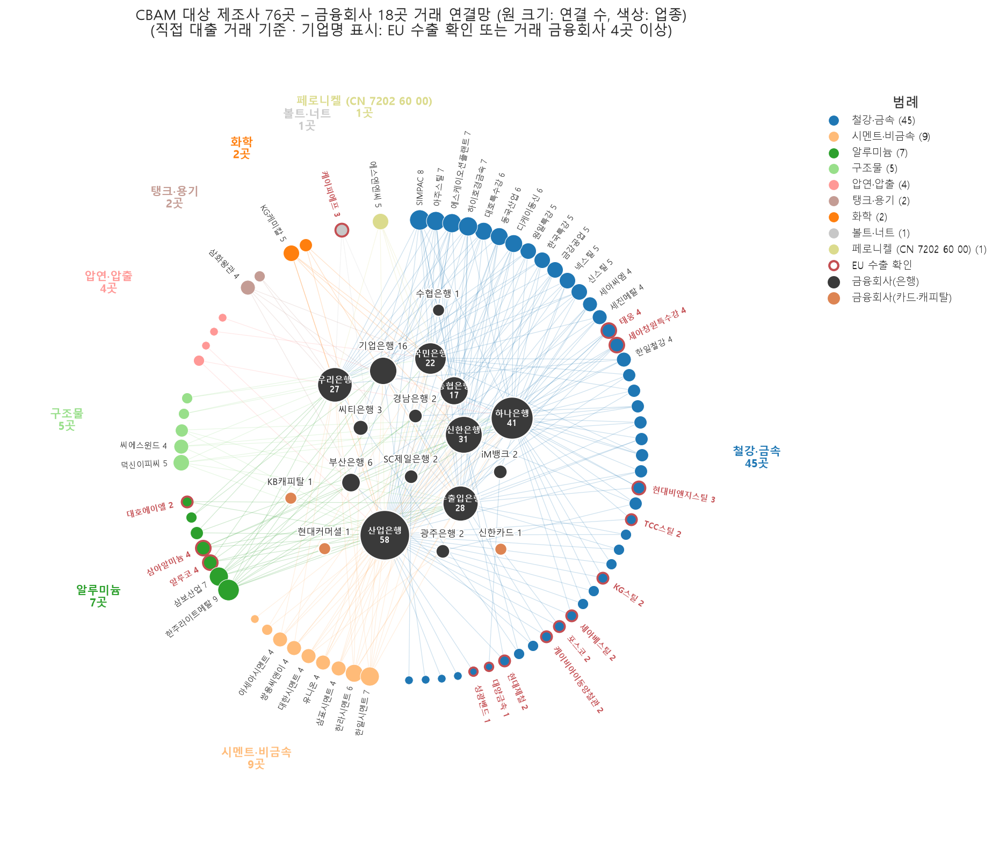
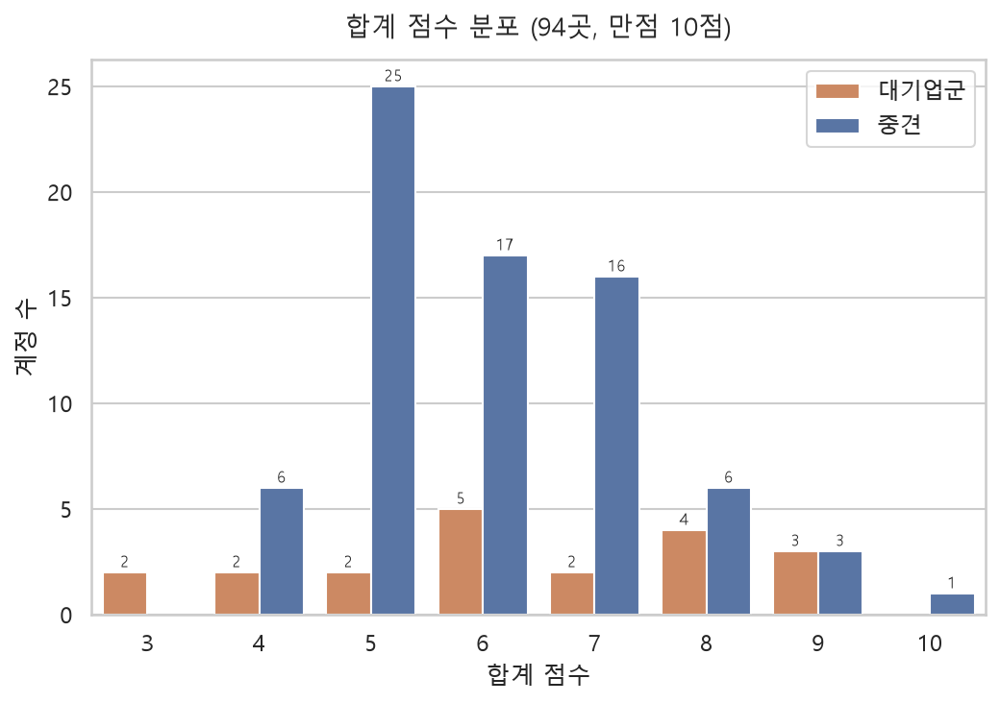
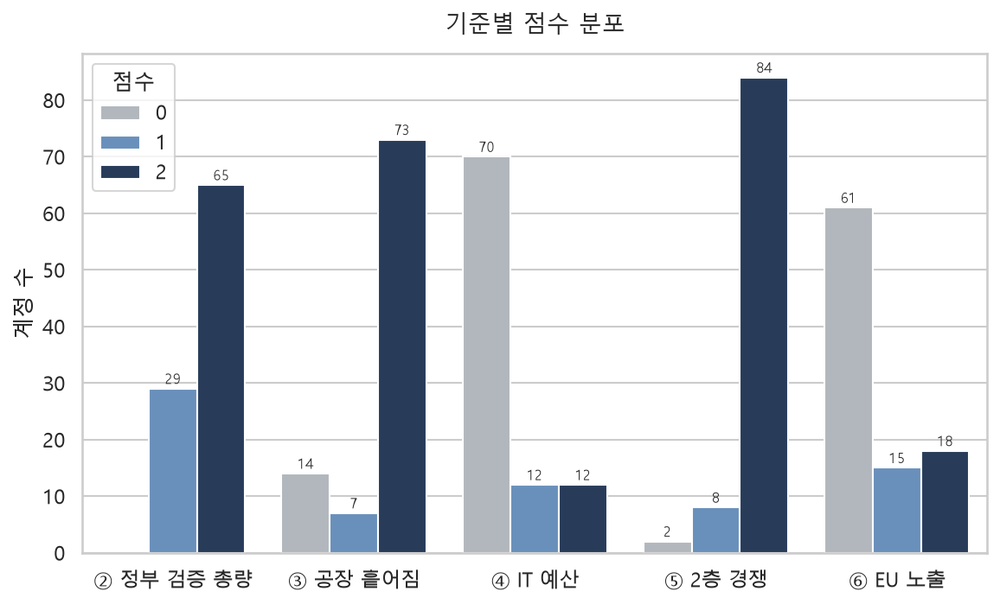
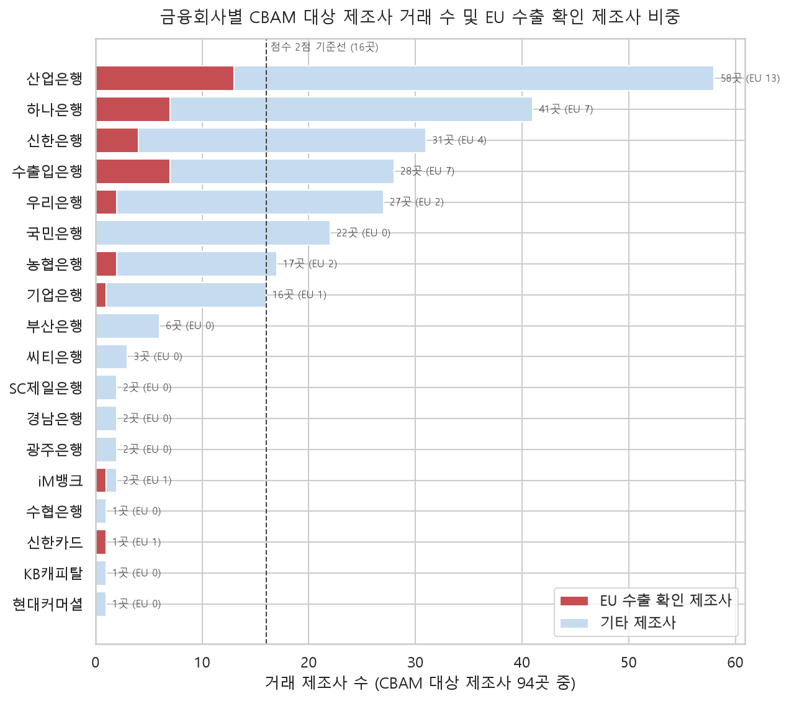
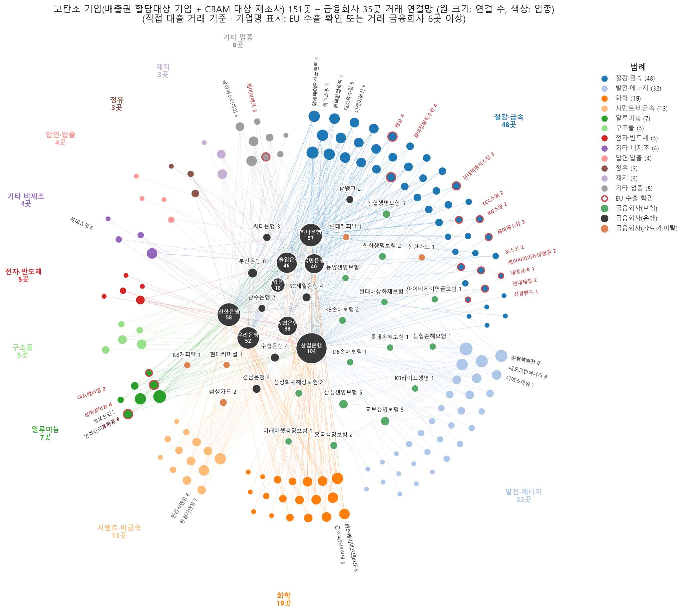
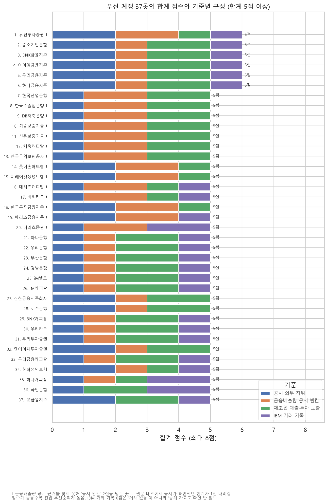
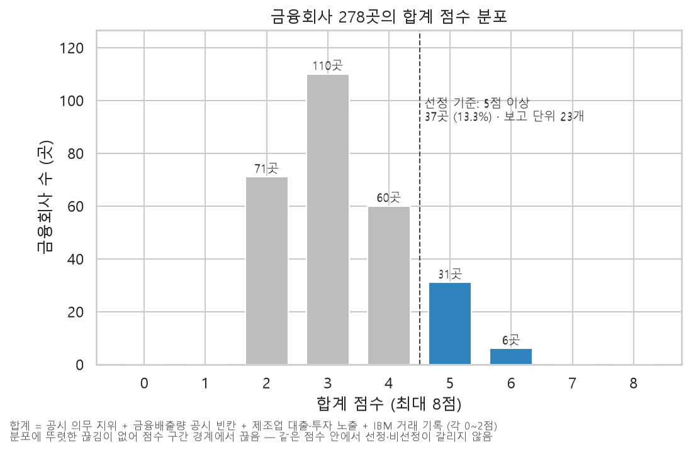
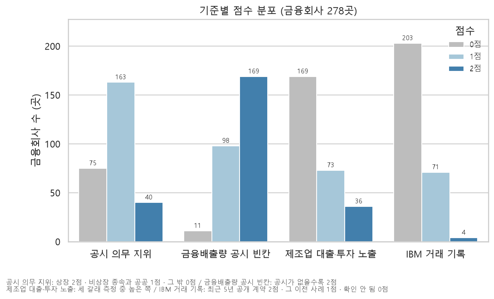

# 탄소 데이터 거버넌스 투트랙 — 제조·금융 우선 계정과 연도별 진입 경로

> 공개 자료만으로 IBM watsonx.data intelligence(탄소 데이터 거버넌스)의 우선 제안 대상 제조사·금융사를 점수로 선별하고, 규제 일정에 근거해 접촉 시기를 결정한 분석임
> 기준일 2026-10-01 · 대상 제조 140곳(1차 94 · 하류 후보 46) · 금융 278곳

---

## 1. 결론

### 1-1. 권고 — 결론에 따른 즉시 이행

**현재 상황 — 제조·금융 양 시장의 탄소 데이터 거버넌스 영역 공급자 부재**

- H1 (채택): CBAM 1차 업종 제조사 과반은 탄소 데이터 거버넌스 솔루션 도입이 확인되지 않음 — 94곳 중 92곳(97.9%) 해당
- H2 (채택): 구매 필요성(정부 검증 총량과 제품별 CBAM 배출량의 대조 의무)·구매 여력(IT 투자액 상위 2/3)·진입 여지(거버넌스 경쟁 부재)를 동시에 충족하는 제조사가 존재함 — 20곳 확인
- H3 (채택): 금융사 과반은 차주 배출량 데이터가 부족하며, 신정원 금융배출량 플랫폼은 금융사별 출처 구분·변경 이력·인증 대비 증빙을 담당하지 않음 — 278곳 중 267곳(96.0%) 해당

**원인 — 의무 시점 확정 및 공백 기간 한정**

- CBAM 첫 연례 신고 기한은 2027-09-30으로 확정됨. 실측 데이터 미제출 시 기본값 할증률이 2026년 10%에서 2028년 30%까지 확대됨
- 금융배출량 법정 공시는 2031년(자산 10조 이상) 시행으로 확정됨. 준비 기한은 2029년 말임
- 그룹 IT 계열사·탄소 관리 플랫폼·신정원 플랫폼의 거버넌스 영역 확장 가능성이 상존함. 확장 시 선점 기회가 소멸함

**필요한 행동 — 순위표와 로드맵에 따른 즉시 접촉 개시**

- 2026년 하반기 제조 10곳 → 2027년 제조 7곳 → 2028년 하류 13곳 → 2029~2030년 금융 37곳 순으로 접촉을 개시해야 함
- 대상 확대 및 일정 연기 없이 본 순위표와 로드맵을 원안대로 이행해야 함

### 1-2. 요약

| 트랙 | 채점 대상 | 우선 계정 | 접촉 시기 | 가설 판정 |
|---|---|---|---|---|
| 제조 — CBAM 1차 업종 | 94곳 (중견 74 · 대기업군 20) | **17곳** (합계 8점 이상, 중견 10 · 대기업군 7) | **2026년 하반기 10곳**(EU 노출 확인·신규) · **2027년 7곳** | H1 채택 · H2 채택 · H5 부분 채택 |
| 제조 — CBAM 하류 후보 | 46곳 (중견 36 · 대기업 10) | 후보 전체 (EU 확대 미확정) | **2028년 13곳**(합계 7점 이상) · 33곳 확정 후 재평가 | — |
| 금융 | 278곳 (보고 단위 150개) | **37곳** (합계 5점 이상, 보고 단위 23개) | **2029년 36곳** · **2030년 1곳** | H3 채택 |

- 제품의 공백 충족 가능 여부(H4)는 공식 문서 기준 **부분 채택** — SQL·ETL·Java·C# 구간은 자동 추적 가능, Python·엑셀 구간은 조건부 추적. 실제 고객 데이터 적용은 미검증
- 제조 제안 문구: **"단일 탄소 데이터를 CBAM 신고·ESG 공시·은행 전환금융 심사에 공통 제출하는 체계"**
- 금융 제안 영역: **신정원 금융배출량 플랫폼을 대체하지 않고, 플랫폼 산출물을 수령해 금융사 내부에서 출처 구분(추정치 vs 실측)·변경 이력·인증 대비 증빙을 관리하는 영역**

- 두 트랙은 별도로 진행하며 우열을 비교하지 않음. 다만 상기 연결망과 같이 CBAM 대상 제조사의 배출 데이터는 해당 제조사에 대출한 금융회사의 금융배출량 입력값이 되므로, 제조 트랙에서 구축한 증빙이 금융 트랙의 실측 데이터로 연계됨

### 1-3. 우선 계정

**제조 — CBAM 1차 업종 17곳**

| 접촉 시기 | 계정 | 사유 |
|---|---|---|
| 2026년 하반기 (10곳) | KG스틸 · 포스코 · 현대제철 · 태웅 · 현대비앤지스틸 · TCC스틸 · 대양금속 · 대호에이엘 · SK오션플랜트 · 세아베스틸 | EU 노출 확인·신규 — 2027-02 인증서 판매 및 2027-09-30 첫 연례 신고 이전에 EU 수입자의 데이터 요청이 발생함 |
| 2027년 (7곳) | SIMPAC · 고려제강 · 세아제강 · 남해화학 · 동국산업 · 대한제강 · 한일시멘트 | EU 노출 축소·불명 5곳은 재확인 대상, 대한제강·한일시멘트는 국내 규제 대응 수요 |

**제조 — CBAM 하류 후보 중 2028년 13곳 (미확정)**

- 삼기 · HD건설기계 · HD현대일렉트릭 · HL만도 · 일진전기 · 효성중공업 · 경창산업 · 대한전선 · 평화산업 · 대동 · SNT다이내믹스 · SNT모티브 · 지엠비코리아

**금융 37곳 (보고 단위 23개)**

| 보고 단위 | 계정 |
|---|---|
| 우리금융 (5) | 우리금융지주 · 우리은행 · 우리카드 · 우리투자증권 · 우리금융캐피탈 |
| BNK금융 (4) | BNK금융지주 · 부산은행 · 경남은행 · BNK캐피탈 |
| iM금융 (3) | 아이엠금융지주 · iM뱅크 · iM캐피탈 |
| 하나금융 (3) | 하나금융지주 · 하나은행 · 하나캐피탈 |
| 메리츠금융 (3) | 메리츠금융지주 · 메리츠증권 · 메리츠캐피탈 |
| KB금융 (2) | KB금융지주 · 국민은행 |
| 단독 단위 (17) | 유진투자증권 · 중소기업은행 · 한국산업은행 · 한국수출입은행 · DB저축은행 · 기술보증기금 · 신용보증기금 · 키움캐피탈 · 한국무역보험공사 · 롯데손해보험 · 미래에셋생명 · 비씨카드 · 한국투자금융지주 · 신한금융지주 · 제주은행 · NH투자증권 · 한화생명 |

### 1-4. 접촉 시기 판단 기준

| 트랙 | 기준 | 적용 사유 |
|---|---|---|
| 제조 1차 | EU 노출 확인·신규 → 2026년 하반기, 그 외 → 2027년 | CBAM 첫 연례 신고(2027-09-30) 이전에 EU 수입자가 실측 데이터를 요구함. 실측 데이터 미제출 시 기본값 할증률이 2026년 10% → 2027년 20% → 2028년 30%로 확대됨 |
| 제조 하류 | 합계 7점 이상 → 2028년, 그 외 → 확정 후 재평가 | 하류 확대는 2026-09-15 유럽의회 입장 채택 이후 3자 협상 단계이며 적용 목표일은 2028-01-01임. 확정 전이므로 상위 계정만 우선 배치함 |
| 금융 | ESG 공시 연도 2028(자산 10조 이상) → 2029년, 2029·2030(검토) → 2030년, 알리오(공공) → 2029년, 대상 아님 → 2030년 | 금융배출량(Scope 3)은 ESG 공시 시작 3년 후 법정 의무화(10조 이상 2031년)되며 준비 기한은 2029년 말임. 제3자 인증은 2030년부터 시행(범위 미정) |

---

## 2. 프로젝트 목적

- 기술영업 발굴 단계의 산출물임 — 영역 전체 고객 목록이 아닌 **단일 공략 주제(탄소 데이터 거버넌스)의 우선 계정 목록과 접촉 시기**를 결정함
- 공개 자료(공시 원문·정부 고시·감독기관 통계·회사 공식 자료)만으로 점수를 산정하고, 판정 근거를 파일로 기록해 재계산이 가능하도록 함
- 판매 제품의 정의 — 산정 자체가 아닌, 산정에 투입된 데이터의 출처·품질·변경 이력을 관리함

| 층 | 기능 | 현재 공급자 | 판매 여부 |
|---|---|---|---|
| 1 수집·연결 | 공장·ERP·고지서·외부 데이터 수집 | 제조: 히스토리안·SI·무료 도구 / 금융: 신정원 금융배출량 플랫폼 | 부분 (경쟁 다수) |
| **2 거버넌스** | **실측/추정/검증 구분, 출처·변경 이력 기록** | **공급자 부재** | **판매 대상 (watsonx.data intelligence — 계보·품질·카탈로그)** |
| 3 산정 | CBAM 배출량·금융배출량 산정 | 신정원 플랫폼(PCAF 산식), 탄소 스타트업, SI | 판매 대상 아님 |
| 4 분석·활용 | 대시보드·감축 시나리오 | 고객 자체 | 판매 대상 아님 |

- 설정 질문과 결과

| 번호 | 질문 | 결과 |
|---|---|---|
| Q1·Q2·Q3 | 제조 1차·하류, 금융의 접근 우선순위 | 순위표 3종 (`data/processed/final_ranking.csv`) |
| Q4 | 접촉 시기의 근거인 규제 일정의 현재 유효성 | 2026-10-01 기준 확인 (1-4, 3장) |
| Q5 | 각 트랙 내 제품 진입 공백의 존재 여부 | H1·H2·H3 채택 |
| Q6 | 제품의 공백 충족 가능 여부 | H4 부분 채택 (공식 문서 기준) |
| Q7 | 제조사 탄소 데이터의 은행 서류·대출 심사 기여 여부 | H5 부분 채택 |

---

## 3. 트랙 이원화 사유

| 구분 | 제조 트랙 | 금융 트랙 |
|---|---|---|
| 수요 발생 규제 | CBAM — 2026-01-01 확정기간 개시, 2027-02-01 인증서 판매, 2027-09-30 첫 연례 신고 | ESG(기후) 공시 — 2028년 자산 10조 이상 코스피부터, 연결 종속회사 포함. 금융배출량은 2031년부터 법정 의무(10조 이상), 제3자 인증 2030년부터 |
| 증명 대상 수치 | 자사 설비·제품의 배출량 (전구물질 포함) | 차주 배출량 × 대출 비율 |
| 실측 데이터 미제출 시 | 기본값에 할증 적용 (2026년 10% → 2028년 30%) | 추정치 사용 가능, 초기 면책 |
| 데이터 원천 | 내부 (계측·ERP·고지서·K-ETS 명세서) | 외부 (차주 공시·CBAM 보고서·추정 DB·신정원 플랫폼) |
| 기존 대체재 | 정부 지원 FEMS·MRV, 탄소관리 플랫폼, 그룹 IT 계열사, 대기업 자체 LCA | 신정원 금융배출량 플랫폼, 기후금융 웹포털 |
| 접촉 시기 | 1차 2026~2027년, 하류 2028년 | 2029~2030년 |

- **동일 제품의 양 트랙 판매 사유**
  - 양 트랙 모두 다수 원천에서 수집한 탄소 수치를 외부 검증에 제출해야 함
  - 양 트랙 모두 수치 자체보다 수치의 근거를 증명해야 함
  - 필요 기능(출처 추적·품질 관리·데이터 수집)이 동일함
- **양 트랙의 연계 지점**: 제조사가 은행 서류·대출 심사에 제출하는 배출 데이터(출처·실측 여부·검증 이력 포함)는 금융사 관점에서 차주 제출 자료에 해당함. 구매 주체는 각 트랙의 고객이며, IBM이 양측을 연결하는 플랫폼을 구축하는 구조가 아님
- **별도 진행 사유**: 규제 주체·시점·예산 구조가 상이해 단일 순위로 비교할 수 없음. 트랙별로 결론을 도출함

---

## 4. 제조 트랙

### 4-1. 가설과 판정 기준

| 가설 | 채택 | 부분 채택 | 기각 |
|---|---|---|---|
| H1 CBAM 1차 업종 제조사 과반은 탄소 데이터 거버넌스 솔루션 도입이 확인되지 않음 | ⑤ 1점 이상 과반 | 과반이나 합계 상위 1/3에서 ⑤ 0점 과반 | ⑤ 0점 과반 |
| H2 구매 필요성(② 2점)·구매 여력(④ 1점 이상)·진입 여지(⑤ 1점 이상)를 동시에 충족하는 계정이 1곳 이상 존재함 | 1곳 이상 | — | 0곳 |
| H5 은행의 녹색·전환금융·금융배출량 산정이 차주에게 검증 가능한 배출 데이터를 요구하거나 우대함 | 당국 가이드라인 또는 은행 2곳 이상에서 요구·우대 확인 | 요구는 존재하나 신정원 DB·외부 검토로 대체 가능 | 요구·우대 사례 없음 |

- 판정 기준은 결과 확인 전에 확정했으며 결과에 따라 변경하지 않음

### 4-2. 제조-1 — 명단 확정

| 판단 기준 | 적용 사유 |
|---|---|
| CBAM 1차 업종 제조사 중 중견·대기업·외국계 대기업 계열만 포함, 중소기업 제외 | 중소기업은 예산 규모가 IBM 직접 판매 규모에 부합하지 않음 |
| 규모는 중소기업기본법 시행령(2025-09-01 개정) 기준 7단계로 판정 | 중견·대기업 경계를 법정 기준으로 재현 가능하게 설정함 |
| CBAM 1차 업종은 상장사는 품목, 비상장사는 배출권 업종코드 기준으로 판정하고 합금철은 품목까지 확인 | CBAM은 품목(CN) 단위 제도이므로 업종만으로는 대상 여부가 구분되지 않음 |
| 지주회사는 제외하고 공장을 보유한 사업회사를 포함 | 배출 데이터의 생성 주체는 사업회사임 |
| 동명 회사는 법인등록번호·등록공장 생산품·주소로 구분 | 회사명만으로는 타 회사가 혼입됨 |
| 합병 소멸·주력 품목 생산 중단은 제외, 사업 양도는 양수 회사로 교체 | 현재 CBAM 데이터를 생성하는 법인을 대상으로 함 |
| EU 수출 미확인 계정도 제외하지 않고 표시만 함 | 전구물질 경로로 EU 직수출이 없어도 EU 수출 고객에 대한 데이터 제공 의무가 발생함 |

- 결과: 95곳 확정, 변동 확인 후 94곳 채점 (중견 74 · 대기업 9 · 대기업 계열 9 · 외국계 대기업 계열 2)
- 은행 연계 근거(V6): 녹색여신 관리지침 제11조가 채무자로부터 적합성 판단 근거자료 징구를 규정하고, 전환금융 가이드라인이 서약서·실행계획 제출 및 감축 효과별 우대(1.0~3.2%)를 규정함. 다만 금융회사 대리 판단 및 채무자 확인서 대체가 허용됨

### 4-3. 제조-2 — 채점과 가설 검증

| 기준 (각 0~2점, 최대 10점) | 2점 | 1점 | 0점 | 적용 사유 |
|---|---|---|---|---|
| ② 총량-제품별 대조 필요성 | CBAM + 정부 검증 총량(배출권 할당대상 또는 목표관리업체) | CBAM만 | — | 정부 검증 사업장 총량과 제품별 CBAM 수치의 대조가 필요해 출처 관리 부담이 최대임 |
| ③ 데이터 분산도 | 공장 3곳 이상 또는 2개 이상 시·도 | 공장 2곳 | 공장 1곳 | 데이터 원천이 분산될수록 출처·계보 관리의 가치가 증가함 |
| ④ IT 예산 | 자료 보유 기업 중 상위 1/3 | 중간 1/3 | 하위 1/3 또는 자료 없음 | 구매 여력을 측정함. 중견과 대기업을 별도로 3등분해 규모 편차를 축소함 |
| ⑤ 2층(거버넌스) 경쟁 | 원문·보도 모두 없음 | 1개 원천만 존재 | 원문·보도 모두 존재 | 진입 여지를 측정함. 사업보고서 원문과 보도가 모두 뒷받침하는 경우에만 확정 경쟁으로 판단함 |
| ⑥ EU 노출 | 확인·신규, 또는 축소이면서 전구물질 | 축소·불명 | 미확인·없음 | CBAM 수요는 EU 반출에서 발생함. 해외 매출 비중이 아닌 EU 노출로 측정함 |

- 동점 처리: ② → ⑥ → ④
- ⑤ 판정 세부: 상용 플랫폼 도입·그룹 IT 계열사 플랫폼·자체 구축 LCA는 0점, 원청 무상 도구·작성 대행 컨설팅은 1점, 에너지 관리 시스템(FEMS)만 보유 시 2점. 3층(산정 솔루션·LCA·EPD)만 보유한 경우는 2층 경쟁으로 간주하지 않음
- ⑥ 판정 세부: EU 매출 확인 계정에 생산지(역내 생산 여부)·품목 일치 여부를 결합해 확인·신규·축소·불명으로 분류함 — 40곳 판정, 확인 16 · 신규 1 · 축소 8 · 불명 8 · 미확인 7

| 결과 | 내용 |
|---|---|
| 기준별 분포 (2/1/0점) | ② 65/29/— · ③ 73/7/14 · ④ 12/12/70 · ⑤ 84/8/2 · ⑥ 18/15/61 |
| 합계 분포 (만점 10점) | 10점 1 · 9점 6 · 8점 10 · 7점 18 · 6점 22 · 5점 27 · 4점 8 · 3점 2 |
| **H1** | **채택** — ⑤ 1점 이상 92/94곳(97.9%). 합계 상위 1/3 31곳 중 ⑤ 0점 1곳 |
| **H2** | **채택** — 세 조건 충족 20곳 (중견 14 · 대기업군 6) |
| **H5** | **부분 채택** — 요구는 존재하나 신정원 웹포털·PCAF 추정치·채무자 확인서로 대체 가능함 |

| 선정 기준 | 적용 사유 |
|---|---|
| 합계 8점 이상 17곳 | 다섯 기준 합계로 산정한 순위표의 목적과 일치함. 7점 구간 18곳은 단일 집단이므로 분할 시 동일 점수 간 선정 여부가 분리됨. 17곳은 2026~2027년 접촉 규모로 관리 가능함 |
| H2 충족 20곳은 선정 기준으로 사용하지 않음 | H2는 존재 확인용 가설이며 ③·⑥이 제외되어 있음. 적용 시 EU 노출 확인 4곳이 누락되고 EU 노출이 없는 7곳이 포함됨 |

- 은행 차입 표시(점수 미반영): 합계 7점 이상 35곳 중 32곳(91%)이 산업·수출입·기업은행과 거래함 — 연계 제안 문구에 활용함

### 4-4. 제조-3 — CBAM 하류 후보

| 판단 기준 | 적용 사유 |
|---|---|
| EU 집행위 확대안(COM(2025) 989, 약 180개 품목) 기준 하류 품목 확인 계정 중 중견·대기업 46곳 | 제품 확인을 완료한 후보만 채점함. 이사회(약 200개 추가)·의회(457개) 안은 범위가 더 넓어 46곳은 하한에 해당함 |
| ②③④는 제조-2와 동일 기준, ⑤는 잠정 2점, ⑥은 미채점 | 하류 확대 확정 전이므로 개별 경쟁·EU 노출 조사는 확정 후 수행함 |
| 사명 변경·합병 계정은 구 명칭으로 대조하고 지위를 승계한 것으로 간주 | 등록공장(2024-12-31)·배출권 명단(2026-01-01)에 구 명칭으로 등재되어 있음 (HD건설기계 ← HD현대건설기계·HD현대인프라코어 합병) |
| 전 계정에 하류 후보(미확정) 표시 | 3자 협상 결과에 따라 대상 품목이 변경됨 |

- 결과: ② 2점 12곳(할당대상 8 · 목표관리업체 3 · 합병 승계 1) · 합계 8점 6 · 7점 7 · 6점 6 · 5점 15 · 4점 6 · 3점 6
- ⑤가 46곳 모두 동일하므로 순위는 ②③④로 결정됨

---

## 5. 금융 트랙

### 5-1. 가설과 판정 기준

| 가설 | 채택 | 부분 채택 | 기각 |
|---|---|---|---|
| H3 금융사 과반은 차주 배출량 데이터가 부족하며(② 1점 이상), 신정원 플랫폼은 금융사별 출처 구분·변경 이력·인증 대비 증빙을 담당하지 않음 | ② 1점 이상 과반 + 플랫폼의 해당 영역 확대 공식 계획 없음 | ② 조건만 충족 | 해당 영역 확대 공식 계획 확인, 또는 ② 0점 과반 |

- 기각 시 금융 트랙을 신정원 플랫폼 연계 영역으로 축소함

### 5-2. 금융-1 — 대상 확정

| 판단 기준 | 적용 사유 |
|---|---|
| 코스피 상장 금융사(연결자산 2조 이상)와 그 종속 금융회사(자산 하한 없음) | ESG 공시 범위가 연결 종속회사를 포함함 |
| 명단 외 코스피 상장사(업종 무관)의 종속 금융회사 | 지배회사의 연결 공시에 포함됨 (현대카드 등) |
| 비상장 비종속 — 대기업집단 금융보험사·공공금융기관 5곳·독립·외국계, 자산 2조 이상 | 비상장사도 DART 감사보고서로 동일 방식 조사가 가능함. 공공금융기관은 제조 차입처의 중심임 |
| 종속은 보통주 50% 초과, 30~50%·자산 1조 이상은 1차 공시로 실질 지배 판단 | 연결재무제표 범위와 일치시킴 |
| 업권은 회사명이 아닌 표준산업분류(KSIC) 코드로 판정 | 회사명만으로는 카드·캐피탈·지주가 혼재됨 |
| 외국 금융회사 국내 지점·상호금융 단위조합·포트폴리오 미보유 법인(자회사형 GA·신용정보사 등)·리츠·펀드 제외 | 구매 결정 주체가 아니거나 배출량 산정 대상 자산이 없음 |
| 여신 미보유만을 사유로 제외하지 않음 | PCAF는 금융배출량·촉진배출량(증권 인수)·보험배출량으로 구분되어 증권·보험도 산정 대상임 |
| 공공금융기관 규모는 연말 대출 + 보증 잔액으로 측정 | 보증기관은 자산보다 보증잔액이 실제 노출임 |

- 결과: 278곳 — 은행 18 · 금융지주 10 · 공공 5 · 카드·캐피탈 41 · 증권 31 · 생명보험 20 · 손해보험 15 · 저축은행 28 · 자산운용·신탁 75 · 기타 35 (제외 목록 6,670행)

### 5-3. 금융-2 — 보고 단위와 ① 공시 지위

| 판단 기준 | 적용 사유 |
|---|---|
| 소유 관계로 묶은 대표 회사를 보고 단위로 설정 (150개) | 금융배출량 공시와 IT 구매가 그룹 단위로 이루어짐 |
| ① 상장 2점 / 비상장 종속·공공금융기관·공공기관 종속 1점 / 그 외 비상장 비종속·지배회사 연결자산 2조 미만 종속 0점 | 법정 공시 강제력의 차이를 반영함. 공공은 알리오 통합공시 의무가 있으나 위반 시 경영평가 감점에 그쳐 자본시장법 대비 강제력이 약함 |

- 결과: ① 2점 40 · 1점 163 · 0점 75

### 5-4. 금융-2 — ③ 제조 포트폴리오 노출 (3개 층)

| 판단 기준 | 적용 사유 |
|---|---|
| ③-3 CBAM 연결: 제조 94곳의 차입처 금융회사별 거래 건수 — 16곳 이상 2점 · 1곳 이상 1점 | 양 트랙의 연결 지점 — 제조사 데이터의 실제 수령 금융회사임 |
| ③-2 고탄소 노출: 배출권 할당대상 153곳(사전할당량 누적 90% + 제조 중복 54곳)의 차입처 금융회사별 거래 건수 — 30곳 이상 2점 · 1곳 이상 1점 | 금융배출량은 고탄소 차주에 대출한 금융회사에서 대규모로 발생함 |
| 집계 대상 거래: 명단 금융회사의 직접 대출·보유분, 2025년 말 잔액, 회사명 명시분, 금융회사 계정별 | 금융배출량(PCAF)은 대출·채권 보유 주체에 귀속됨. 증권사 CP 중개·사채·외국 금융회사는 제외함 |
| 문턱은 자연 경계 적용 | 0곳 비중이 90% 내외여서 3등분 경계가 모두 0이 됨 |
| ③-1 제조업 노출: 제조업 노출 ÷ 총자산, 실측 98곳 3등분(3.840% 이상 2점 · 1.275% 이상 1점), 총자산 2조 미만·추정값은 최대 1점 | 278곳을 동일 기준으로 측정함. 은행·저축은행·보험은 금감원 FISIS 업종별 대출, 카드·캐피탈·증권은 감사보고서 위험관리 주석 업종표, 금융지주는 자회사 실측 합계(하한), 공공은 보유액 대비 비중을 적용함 |
| ③ = 세 층 중 최댓값 | ③-2·③-3은 차입처 명시 시에만 발생하는 점수여서 금융지주·보증기관은 구조적으로 0점임. 두 층은 유사 대상을 측정하므로(순위 상관 0.65) 평균 시 거래 관계가 이중 반영됨. 평균 방식은 0점 비중이 83%로 변별력이 없음 |

- 차입처는 차주의 2025 사업연도 감사보고서 차입금 주석에서 추출하고, 재무상태표 차입금·원문 총계와 1% 이내 일치 여부를 검산함 (제조 94곳 중 일치 77 · 무차입 15 · 근접 2)

- 결과: ③-3 2점 8 · ③-2 2점 6 · ③-1 2점 36 → ③(최댓값) 2점 36 · 1점 73 · 0점 169
- 거래가 확인된 금융회사 35곳 중 2점 8곳(산업·하나·신한·우리·수출입·국민·농협·기업은행), 보험 15곳은 대부분 발전·집단에너지 PF 대주단으로 포착됨

### 5-5. 금융-2 — ② 현재 공백 (금융배출량 공시 수준)

| 판단 기준 | 적용 사유 |
|---|---|
| 2점: 금융배출량 미공시(공시 근거 미발견 포함) / 1점: 공시하였으나 커버리지 50% 미만 또는 PCAF 품질 3.5 이상, 또는 둘 중 하나라도 미공개 / 0점: 커버리지 50% 이상과 품질 3.5 미만이 모두 확인됨 | 공시 품질이 낮을수록 실측·출처 관리 수요가 큼. 0점은 확정 사례로 한정함 |
| 커버리지는 금액 기준 %만 인정, 품질이 자산군별로만 공개된 경우 금액 가중 평균, 2026년 발간본 우선 | 동일 기준으로 비교함 |
| 근거 강도: 회사명 명시 수치·공식 홈페이지 = 확인 / 측정 시스템·목표 공개·합계 포함·그룹 보고서 범위 = 약함(공시로 간주하되 원문 대조 1순위) / PCAF 가입만·일반 서술 = 자료 없음 | 가입이나 선언은 공시가 아님 |
| 종속회사는 그룹 값 적용, 상장 자회사도 지배회사 그룹 보고서 범위에 포함되면 그룹 값 적용 | 금융배출량은 그룹 보고서가 자회사까지 포함해 공시함 |

- 결과: 2점 169(공시 근거 미발견 166 · 미공시 확인 3) · 1점 98 · 0점 11(KB금융 단위 — 커버리지 84.8% · 품질 3.2)

### 5-6. 금융-2 — ⑤ IBM 관계

| 판단 기준 | 적용 사유 |
|---|---|
| 2점: 최근 5년(2021-10 이후) 공개 계약 / 1점: 그 이전 사례, 업무협약·공동연구, 동일 보고 단위 타 계정의 계약 / 0점: 공개 자료로 확인 불가 | 기존 접점은 영업 진입을 용이하게 함. 협약은 접점이나 구매 증거가 아님 |
| 협력사 경유 도입도 IBM 제품 명시 시 인정 | 고객의 IBM 제품 사용 사실은 동일함 |
| 계약 주체에만 해당 점수 부여, 명단 외 그룹 IT 자회사 계약은 대표 회사 계약으로 간주 | IT 계약은 회사별로 체결됨. 그룹 IT 자회사는 그룹 전산 구매를 대행함 |
| 계속 사용 중인 장비는 계약 시점으로 인정하지 않음, 레드햇 등 IBM 자회사 계약은 참고만 함 | 최근 계약의 증거가 아님. 영업 경로가 상이함 |

- 결과: 2점 4(국민은행 메인프레임 2030년까지 갱신 · 롯데카드 파워10 · 하나캐피탈 재해복구 스토리지 · 메리츠증권 파워11) · 1점 71 · 0점 203

### 5-7. 금융-2 — 합산·선정·H3 판정

| 판단 기준 | 적용 사유 |
|---|---|
| 합계 = ① + ② + ③ + ⑤ (최대 8점), 동점 처리는 ② → ③ → ③-3 점수 → ③-3 곳 수 → ③-2 곳 수 | 진입 여지(②)와 제조 연계(③-3)를 우선함 |
| 선정: 합계 5점 이상 37곳 · 보고 단위 23개 | 분포에 뚜렷한 단절이 없어(6 → 31 → 60 → 110) 제조와 동일한 원칙인 점수 구간 경계로 구분함. 제조 선정 비율(18%)에 최근접 구간(13.3%)임. 6점 이상은 6곳으로 과소하고 4점 이상은 35%로 과다함 |

| 결과 | 내용 |
|---|---|
| 합계 분포 | 6점 6 · 5점 31 · 4점 60 · 3점 110 · 2점 71 |
| 업권별 평균 | 금융지주 5.10 · 공공 5.00 · 은행 4.11 · 카드·캐피탈 3.68 · 증권 3.52 · 손해보험 3.40 · 저축은행 3.21 · 생명보험 2.95 · 자산운용·신탁 2.63 |
| **H3** | **채택** — ② 1점 이상 계정 267/278(96.0%) · 보고 단위 149/150(99.3%) · 우선 계정 35/37. 신정원 플랫폼은 공시 배출량 집적·비상장 추정치·PCAF 표준 산식을 제공하나(2026-02 대출 기준 1차, 전체 자산군 확대 예정), 금융사별 출처 구분·변경 이력·인증 대비 증빙으로의 확대 공식 계획은 공개 자료상 확인되지 않음(확인 2026-09-29) |

### 5-8. H4 — 제품의 공백 충족 가능 여부 (공통)

| 판정 | 근거 (공식 문서) |
|---|---|
| **부분 채택 (문서 기준)** | DB·ETL·리포팅·모델링 스캐너와 Java·C# 스캐너로 자동 추적, OpenLineage 수신·송신 지원, 단독 프로비저닝 가능(계정당 인스턴스 1개). Python은 주석 부착 스크립트만 추적하며 엑셀은 제품 구성에 따라 상이함 |

- 결론 적용 조건: SQL·ETL 중심 흐름은 자동 추적 가능, 엑셀·Python 중심 산정(중견사 CBAM 산정이 해당될 수 있음)은 주석·OpenLineage 연결이 필요함

---

## 6. 참고사항

### 6-1. 조사 원칙

- **정확**: 수치는 원문으로 확인하고, 원인 설명도 원문 확인 후에만 기재함
- **심도**: 배경(규제·업권 구조·소유 관계)까지 연계해 조사함
- **완벽**: 대상 전수를 동일 기준으로 처리하고, 기준 변경 시 기 판정 계정에도 소급 적용함
- **철저**: 확인 사실·추정·미확인 사항을 구분 표시하고, 불리한 근거도 유리한 근거와 동일 비중으로 기재함
- **최근 뉴스**: 규제 일정·회사 변동(합병·매각·사명 변경)은 기준일 직전 자료로 재확인하고 과거 자료는 연도를 명시함

### 6-2. 근거 등급

| 등급 | 자료 |
|---|---|
| 1 | 공시 원문 — DART 사업보고서·감사보고서, KIND |
| 2 | 정부·감독기관 — 금융위·금감원·기재부·통계청 보도자료 |
| 3 | 신용평가사 — 한국기업평가·한국신용평가·NICE, 무디스·S&P |
| 4 | 회사 공식 — 홈페이지·IR 자료·공식 보도자료 |
| 5 | 주요 언론·글로벌 IB — 조선·중앙·동아·한경·매경, 골드만삭스 등 리서치 |
| 사용 배제 | 위키백과·나무위키·취업 정보 사이트·블로그 |

### 6-3. 표기와 판정 절차

- (추정): 근거 기반 추정 · (미정): 제도상 미확정 · (확인 날짜): 복수 출처로 확인한 사실
- 판정별 출처 URL·발행일·확인일·요지를 CSV로 기록함 (`data/manual/`)
- 판정안과 근거를 선제시하고 확정 후 코드에 반영함. 코드 산출 파일은 수기로 수정하지 않음

---

## 7. 참고 문헌

**EU CBAM 제도와 하류 확대**

| 번호 | 출처 | 링크 |
|---|---|---|
| R1 | 독일 배출권거래청(DEHSt), CBAM 확정 제도 안내 | https://www.dehst.de/EN/Topics/CBAM/CBAM-definitive-regime-2026/cbam-definitive-regime-2026_node.html |
| R2 | Greentryst, CBAM 2026 일정 | https://www.greentryst.com/guides/cbam-2026-definitive-regime |
| R3 | HKTDC Research, CBAM 확정기간 패키지 | https://research.hktdc.com/en/article/MjM0OTMyMzA0Nw |
| R4 | Clearscope, CBAM 확정기간 의무 | https://clearscope.ie/blog/cbam-definitive-period-2026/ |
| R5 | EU 집행위 CBAM Q&A | https://taxation-customs.ec.europa.eu/document/download/013fa763-5dce-4726-a204-69fec04d5ce2_en |
| R6 | Georgetown Law IIEL, CBAM 입문서 | https://www.law.georgetown.edu/iiel/wp-content/uploads/sites/8/2025/04/25_CITD_Background-paper-EUs-CBAM-A-Primer-3-1.pdf |
| R7 | Sovran Commodities, 철강·알루미늄 수입자 안내 | https://www.sovrancommodities.com/briefings/eu-cbam-definitive-regime-2026/index.html |
| R8 | ICAP, CBAM 준수 단계 진입 | https://icapcarbonaction.com/en/news/eu-cbam-enters-compliance-phase-and-outlines-path-ahead |
| R9 | Materia Intel, 2026/1740 기본값 정정 | https://www.materiaintel.com/insight/cbam_regulation_2026_1740_default_values_corrections |
| R10 | Eco-Shaper, CBAM 부담 산정 | https://eco-shaper.com/eu-cbam-2026-how-to-calculate-your-liability/ |
| R11 | 유럽의회 조사처(EPRS), 하류 확대 브리핑 (2026-09) | https://eprs.europarl.europa.eu/contents/publications/EPRS/2026/09/EPRS_ATA(2026)791461.html |
| R12 | EU 이사회 보도자료 (2026-06-12) | https://www.consilium.europa.eu/en/press/press-releases/2026/06/12/council-moves-to-strengthen-the-eu-s-carbon-border-adjustment-mechanism/ |
| R13 | VATupdate, 유럽의회 입장 채택 (2026-09-17) | https://www.vatupdate.com/2026/09/17/european-parliament-backs-expansion-of-cbam-to-downstream-steel-and-aluminium-products/ |
| R14 | CBAM Guide, 일정·하류 확대 추적 | https://cbamguide.com/learn/timeline/ |
| R15 | RTÉ, 비료 CBAM 면제 계획 없음 (2026-03) | https://www.rte.ie/news/europe/2026/0330/1565867-fertiliser-eu-tax/ |
| R16 | Carbon Pulse, 비료 행동계획 | https://carbon-pulse.com/513171/ |
| R17 | EUROMETAL, 제27a조 | https://eurometal.net/eu-commission-pushes-ahead-with-clause-to-temporarily-suspend-goods-from-cbam-in-serious-and-unforeseen-circumstances/ |

**국내 공시·기후금융 정책**

| 번호 | 출처 | 링크 |
|---|---|---|
| R18 | 금융위원회 보도자료, 지속가능성 공시 제도화 방안 최종안 (2026-07-08) | https://www.fsc.go.kr/no010101/87280 |
| R19 | 한경비즈니스, ESG 공시 로드맵 확정 (2026-07-08) | https://magazine.hankyung.com/business/article/202607070715b |
| R20 | 머니투데이, 코스피 291개사 대상 (2026-07-09) | https://www.mt.co.kr/stock/2026/07/09/2026070820001717133 |
| R21 | 조세금융신문, KSSB 첫 번째 세트 의결 | https://www.tfmedia.co.kr/news/article.html?no=201983 |
| R22 | 경향신문 기고, 인증의 독립성 (2026-08) | https://www.khan.co.kr/article/202608051959005/ |
| R23 | 법률신문, ESG 공시 자본시장법 개정안 발의 | https://www.lawtimes.co.kr/news/articleView.html?idxno=226944 |
| R24 | 이투데이(서플), 8월 ESG 공시법 3건 (2026-08-31) | https://supple.kr/news/cmtg8lsig000xy5sv1gqaj6sb |
| R25 | ESG경제, 배출권거래제 데이터 기후공시 활용 (2026-05-30) | https://www.esgeconomy.com/news/articleView.html?idxno=15643 |
| R26 | ESG경제, 배출권거래제 지침으로 공시하는 기업의 보완점 (2026-09-23) | https://www.esgeconomy.com/news/articleView.html?idxno=16821 |
| R27 | Lexology, 국내 ESG 공시 도입 시사점 | https://www.lexology.com/library/detail.aspx?g=2acf2d5d-9c09-4d1f-9a60-896673f6a9fa |
| R28 | 금융위원회 보도자료, 제4차 생산적금융 대전환 회의 (2026-02) | https://fsc.go.kr/no010101/86326 |
| R29 | 프라임경제, 790조 원 기후금융 | https://www.newsprime.co.kr/news/article/?no=725333 |
| R30 | 한국금융신문, 신정원 기후금융 웹포털 정식 가동 (2026-08-25) | https://www.fntimes.com/html/view.php?ud=2026082517554552591b5a221379_18 |
| R31 | PwC 삼일, 기후금융 활성화 방안 브리프 | https://www.pwc.com/kr/ko/insights/issue-brief/climate-finance-boost.html |
| R32 | 이투데이(서플), 신용정보원 기후금융 웹포털 정식 개시 (2026-08-25) | https://supple.kr/news/cmt7ybd6w000b5q12uf705vwt |
| R33 | 녹색경제신문, ESG 기본법 초안 (2026-09-30) | https://www.greened.kr/news/articleView.html?idxno=351022 |
| R34 | 이투데이, 공공기관 통합공시 ESG 강화 (2023-02) | https://www.etoday.co.kr/news/view/2218467 |
| R35 | 임팩트온, 기재부 공공기관 ESG 가이드라인 확정 (2025-12) | http://www.impacton.net/news/articleView.html?idxno=17337 |

**금융배출량과 금융사 공시**

| 번호 | 출처 | 링크 |
|---|---|---|
| R36 | 머니투데이, 국책은행 금융배출량 산정 현황 (2026-09-17) | https://www.mt.co.kr/politics/2026/09/17/2026091709484834141 |
| R37 | PCAF, Insurance-Associated Emissions Standard 2판 (2025) | https://carbonaccountingfinancials.com/files/standard-launch-2025/PCAF-PartC-2025-V2.pdf |
| R38 | 머니투데이방송(MTN), 교보증권 2025 통합보고서 발간 (2026-07-01) | https://news.mtn.co.kr/news-detail/2026070110462056700 |
| R39 | 기후솔루션, 손해보험사의 금융배출량 및 보험배출량 분석 (2024-08-16) | https://forourclimate.org/ko/research/526 |
| R40 | 아시아경제, 보험사 6곳 온실가스 배출량 (2025-07-09) | https://view.asiae.co.kr/article/2025070916390538291 |
| R41 | 다음(아시아경제), 삼성생명 2024년 금융배출량 (2025-07-10) | https://v.daum.net/v/20250710061139281 |
| R42 | 뉴스토마토, DB손보 금융배출량 산정 대상 확대 (2026-09-14) | https://newstomato.com/ReadNews.aspx?no=1313559 |
| R43 | ZDNet, 현대해상 자회사형 GA | https://zdnet.co.kr/view/?no=20210319180807 |
| R44 | 딜사이트, 삼성생명 자회사형 GA (2026-03) | https://dealsite.co.kr/articles/159082 |
| R45 | 한화인, 한화라이프랩 계열사 소개 | https://www.hanwhain.com/web/meet/subsidiary/view.do?seq=766 |

**기업 공시·신용평가·지배 구조**

| 번호 | 출처 | 링크 |
|---|---|---|
| R46 | 현대자동차, 연결재무제표 감사보고서 FY2024 (IR) | https://www.hyundai.com/content/dam/hyundai/ww/en/images/company/investor-relations/financial-Information/report-ko/consolidated-report-ko/2024/2024-q4-consolidated-review-report-ko.pdf |
| R47 | 현대자동차, 사업보고서 FY2023 (KIND) | https://kind.krx.co.kr/external/2024/03/13/002234/20240313005351/11011.htm |
| R48 | 한국신용평가, 현대카드 평가보고서 (2024-09) | https://m.kisrating.com/fileDown.do?menuCd=R8&gubun=2&fileName=rs20240930-10.pdf |
| R49 | 한국신용평가, 현대커머셜 평가보고서 (2025-09) | https://kisrating.com/fileDown.do?menuCd=R8&gubun=2&fileName=rs20250901-19.pdf |
| R50 | DB증권, 사업보고서 FY2025 (KIND) | https://kind.krx.co.kr/external/2026/03/18/001166/20260318005443/11011.htm |
| R51 | EBN, DB저축은행 최대주주 변수 (2026-09) | https://www.ebn.co.kr/news/articleView.html?idxno=1723394 |
| R52 | 딜사이트, 한화투자증권 지배구조 (2021-08-30) | https://dealsite.co.kr/articles/77888 |
| R53 | SBS Biz, HD건설기계 공식 출범 (2026-01-02) | https://biz.sbs.co.kr/amp/article/20000282241 |
| R54 | 통계청, 한국표준산업분류 해설서 | http://kssc.kostat.go.kr |

**IBM 제품**

| 번호 | 출처 | 링크 |
|---|---|---|
| R55 | IBM, watsonx.data intelligence 제품 페이지 | https://www.ibm.com/products/watsonx-data-intelligence |
| R56 | IBM, watsonx.data intelligence 데이터 계보 | https://www.ibm.com/products/watsonx-data-intelligence/data-lineage |
| R57 | IBM 문서, Manta Data Lineage 지원 스캐너 | https://www.ibm.com/docs/en/manta-data-lineage?topic=scanners |
| R58 | Manta 개발진 논문, Java·C# 스캐너 (ICSE-SEIP 2024) | https://dl.acm.org/doi/pdf/10.1145/3639477.3639739 |
| R59 | IBM 지원 문서, MANTA for Cloud Pak for Data 지원 기술 (2024) | https://www.ibm.com/support/pages/manta-automated-data-lineage-ibm-cloud-pak-data-script-counting-details |
| R60 | IBM 문서, watsonx.data intelligence 요금제 (체험판 한도) | https://dataplatform.cloud.ibm.com/docs/content/wsj/getting-started/wxdintell-plans.html |
| R61 | IBM 발표, watsonx.data intelligence OpenLineage 내보내기 | https://www.ibm.com/new/announcements/openlineage-export-in-ibm-watsonx-data-intelligence-expands-interoperability |

**공개 원자료**

| 번호 | 자료 | 활용 단계 |
|---|---|---|
| D1 | 금융감독원 DART OpenAPI(회사개황·재무제표·공시서류 원본) · 한국거래소 KIND | 대상 확정, 차입금 주석, 감사보고서 업종표 |
| D2 | 금융감독원 금융통계정보시스템(FISIS) 오픈 API | 금융 대상(독립·외국계), ③-1 업종별 대출 |
| D3 | 환경부, 배출권거래제 할당대상업체 현황 (2026-01-01 기준) · 4차 계획기간 사전할당량 | 제조 ②, 금융 ③-2 |
| D4 | 산업통상부, 산업부문 온실가스 목표관리업체 지정고시 (2025-100호 · 2026-71호) | 제조 ② |
| D5 | 한국산업단지공단, 전국 등록공장 현황 (2024-12-31) | 제조 ③ |
| D6 | 한국인터넷진흥원, 정보보호 공시 이행 기업 목록 (2025 · 2026) | 제조 ④ |
| D7 | 공정거래위원회, 기업집단·소속회사 개요 (2026-05) | 규모 판정, 금융 대기업집단 비상장 |
| D8 | 한국IBM 공식 뉴스룸 (2017-06~2026-08 전체) | 금융 ⑤ |
| D9 | 선행 분석(cbam-mfg-data-layer-entry)의 CBAM 품목 판정 결과 | 제조 1차·하류 품목 |

- 금융 ②·⑤의 계정별 출처(근거 25건·17건)는 `data/manual/fin_s2_evidence.csv` · `fin_s5_evidence.csv`의 출처·발행일·확인일 항목에 기록함

---

## 8. 한계

| 구분 | 내용 |
|---|---|
| 공개 자료 범위 | 비공개 도입·계약은 파악 불가함. 도입 보도 부재를 진입 여지의 대리 지표로 사용함 |
| 제조 ⑤ | 증거 강도 배점 방식이므로 조사량이 적을수록 점수가 상승하는 구조임. 2점 84곳 중 25곳은 웹 개별검색 미실시로 H1의 97.9%는 과대 산정 가능성이 있음 |
| 제조 ④·③ | ④는 정보보호 공시 대상 기업만 값이 존재함(자료 없음 ≠ 예산 과소). ③은 국내 등록 공장만 집계하며 해외 생산 법인·타 명의 공장은 포착되지 않음 |
| EU 노출 | 생산지·품목별 매출 대부분이 미공시여서 축소·불명 판정에 추정이 포함됨 |
| 제조 하류 | EU 확대가 미확정이며 ⑤는 잠정 2점, ⑥은 미채점임. 집행위안 기준이므로 대상이 하한임. ③ 동명 의심 5곳은 자동 판단 후 표시만 함 |
| 금융 ③-2·③-3 | 차주가 배출량 상위 대기업·CBAM 제조사이므로 중소기업 대출 중심의 저축은행·캐피탈은 구조적으로 0점임(노출 부재가 아닌 미포착). 사채 보유자와 회사명 미기재 대주단 참여 은행은 집계 불가함 |
| 금융 ③-1 | 보험사는 대출만 반영되어 채권 투자 미포함으로 과소 산정됨. 금융지주는 자회사 실측 합계이므로 하한임. 업종표 미보유 약 120곳은 업권 중앙값 추정 또는 자료 없음 처리함 |
| 금융 ② | 원문 PDF 대신 공식 보도자료·언론으로 조사함. 2점 169곳 중 166곳은 공시 근거 미발견이며 미공시 확인이 아님. 선정 37곳 중 14곳이 해당하여 원문 대조 결과에 따라 순위가 하락할 수 있음 |
| 금융 ⑤ | IBM 금융 계약 상당수가 비공개임. 2점 4곳은 전부 인프라 계약이며 최근 5년 내 Data & AI 계약은 확인되지 않음. 2021-11 킨드릴 분사로 일부 인프라 서비스 계약 주체가 변경되었을 가능성이 있음 |
| 선정 경계 | 금융 분포에 단절이 없어 5점 경계는 원칙에 따라 설정한 것이며 통계적 단절이 아님 |
| 제품 적합성 | H4는 공식 문서 기준 판정이며 실제 고객 데이터 적용·성능은 미검증임 |
| 일정 | CBAM 하류 품목, 자본시장법 개정, Scope 3 공시 연도(5조·2조), 인증 범위, 전환금융 모범규준이 미확정임 |
| 담당 조직·구매 의사 | 대기업·대형 금융사는 타 영업 조직이 담당할 가능성이 있음(추정). 가격·예산 배정·실제 구매 의사는 파악 불가함 |

---

## 9. 의의

- 공개 자료만으로 제조 140곳·금융 278곳을 동일 기준으로 채점하여 접촉 대상과 시기를 근거 파일과 함께 재현 가능하게 결정함
- 가설과 판정 기준을 결과 확인 전에 확정하고 불리한 근거를 병기하여 결론의 자료 의존적 왜곡을 차단함
- CBAM 대상 제조사와 대출 금융회사를 차입금 주석으로 직접 연결하여 양 트랙이 동일 탄소 데이터로 연계됨을 수치로 입증함
- 규제 일정을 연도별 진입 경로로 전환하여 순위표를 실행 계획으로 구체화함